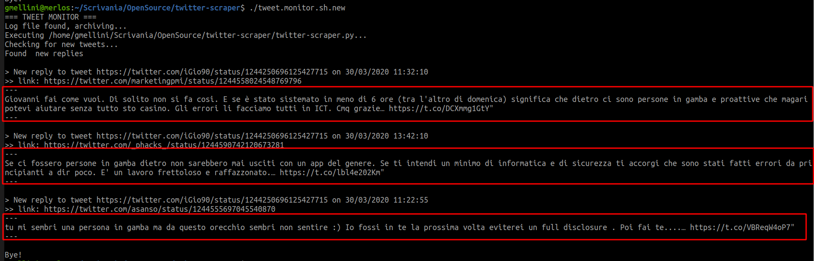

# Twitter Scraper
This project is made of 2 scripts
* [twitter-scraper.py](/twitter-scraper.py) to **get a complete list of twitter threads replies** so you can have a fast and complete view of complex threads even if you are not cited in all the tweet branches
* [tweet.monitor.sh](/tweet.monitor.sh) to **check and be notified about new twitter threads replies**

## twitter-scraper.py
```twitter-scraper.py``` reads a text file fileed with tweets URL (one per line) in the following format 
```https://twitter.com/<SCREEN_NAME>/status/<ID>```

The script checks for replies to the given tweet and writes to stdout, keeping replies indentation.

Option ```-s``` gives a short output that can be useful to diff content between different iterations of the script; this way you can check for newer replies and notify.

```$ ./twitter-scraper.py -h
usage: twitter-scraper.py -f file [-s]
Options:
-f  : name of the input file that contains twitter URLs (1 per line) in the following format: https://twitter.com/<SCREEN_NAME>/status/<ID>
-s  : csv output; useful to diff content between different iterations of the script
```
### Twitter Access Tokens
Before start playing with ```twitter-scraper.py``` you need your Twitter access tokens (keys/secrets).

Generate here https://developer.twitter.com/en/docs/basics/authentication/guides/access-tokens.html

Twitter's API doesn't allow you to get all the replies to a tweet, the script use it to search for replies to a given tweet and replies to any reply as well.

#### Limitation
Twitter search API only returns results from last 7 days. This means that __search results are limited to last 7 days__

### Requirements
The script is tested with python 2.7 and 3.6 on Ubuntu 18.04 and 18.10 

To start playing with ```twitter-scraper.py```:
* install required pip packages:
```
# Python 2.7
sudo pip install python-twitter
sudo pip install pytz
# Python 3
sudo pip3 install python-twitter
sudo pip3 install pytz
```
### Configuration
Before first run change twitter access tokens. Find and replace following placeholders (**mandatory**)
```
CONSUMER_KEY
CONSUMER_SECRET
ACCESS_TOKEN
ACCESS_TOKEN_SECRET
```
Modify script ```local_timezone``` var to print tweet dates in your locale (**optional**)
```
local_timezone = 'Europe/Rome'
```
Full list here: https://gist.github.com/heyalexej/8bf688fd67d7199be4a1682b3eec7568

## tweet.monitor.sh
```tweet.monitor.sh``` is a bash script that uses ```twitter-scraper.py``` csv output to diff between two iteration of the script and show new replies (if any).

Notice that the script execute the following command.
```
twitter-scraper.py -f tweet.list -s
```
Put your tweets in ```tweet.list``` file or edit ```TWEETLIST``` var

If ```curl``` is installed (```sudo apt install curl```) the tweet content is printed. 

Remember to set ```APIKEY``` and ```APISECRETKEY``` to the same value of ```CONSUMER_KEY``` and ```CONSUMER_SECRET``` in ```twitter-scraper.py``` file.


## Examples
## twitter-scraper.py
### command line
```
$ ./twitter-scraper.py  -f tweet.list
[...]
=========================================
[INFO] Start scraping from tweet URL https://twitter.com/benkow_/status/1085483319347867649

/----------------------------------
| From:	 Jesse V. Burke (@Jesse_V_Burke)
| Date:	 16/01/2019 14:01:07
| URL:	 https://twitter.com/Jesse_V_Burke/status/1085522335095054336
| @benkow_ Benkow I have slides analyzing bulehero probably 6+ months ago. DM me let’s chat about this c2
\----------------------------------

/----------------------------------
| From:	 Benkøw moʞuƎq (@benkow_)
| Date:	 16/01/2019 12:17:21
| URL:	 https://twitter.com/benkow_/status/1085496220183945216
| A lot of web vulns / BF  behind that binary (looks like a worm)
\----------------------------------

  /----------------------------------
  | From:	 Benkøw moʞuƎq (@benkow_)
  | Date:	 16/01/2019 12:20:55
  | URL:	 https://twitter.com/benkow_/status/1085497120726097921
  | also Eternalblue
  \----------------------------------
[...]
$ ./twitter-scraper.py  -f tweet.list -s
date,reply,parent_thread
16/01/2019 14:01:07,https://twitter.com/Jesse_V_Burke/status/1085522335095054336,https://twitter.com/benkow_/status/1085483319347867649
16/01/2019 12:17:21,https://twitter.com/benkow_/status/1085496220183945216,https://twitter.com/benkow_/status/1085483319347867649
16/01/2019 12:20:55,https://twitter.com/benkow_/status/1085497120726097921,https://twitter.com/benkow_/status/1085483319347867649
[...]

```
### video
[](https://asciinema.org/a/222043)
## tweet.monitor.sh
### command line
```
$ ./tweet.monitor.sh 
=== TWEET MONITOR ===
Log file found, archiving...
Executing ~/twitter-scraper/twitter-scraper.py...
Checking for new tweets...
Found  new replies

> New reply to tweet https://twitter.com/iGio90/status/1244250696125427715 on 30/03/2020 11:32:10
>> link: https://twitter.com/marketingpmi/status/1244558024548769796
---
Giovanni fai come vuoi. Di solito non si fa cosi. E se è stato sistemato in meno di 6 ore (tra l'altro di domenica) significa che dietro ci sono persone in gamba e proattive che magari potevi aiutare senza tutto sto casino. Gli errori li facciamo tutti in ICT. Cmq grazie… https://t.co/DCXmmg1GtY" 
---
[...]
Bye!
```
### video
[](https://asciinema.org/a/222073)
## Credits
Based on the initial work made by @edsu
https://gist.github.com/edsu/54e6f7d63df3866a87a15aed17b51eaf
